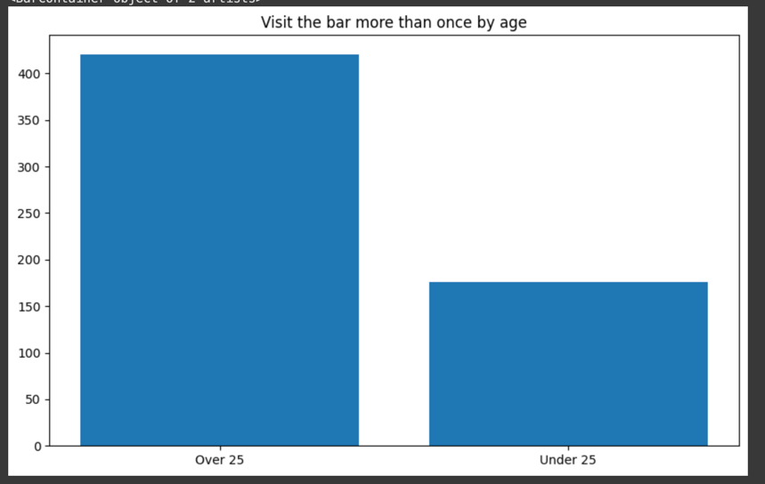

# Coupon Acceptance Analysis

## Research Link
https://colab.research.google.com/drive/1i0IklnphRaDpharv2eH8CM8oukMSneNB?usp=sharing

## Bar Coupons
### Summary
From our analysis, we can conclude that potential drivers who are the most likely to accept coupons are those who do 
not frequently go to the bar (fewer than 3 times per month), are over 25 years of age, do not work in fishing, farming, 
or forestry, and are driving without kids as passengers.

### Analysis Criteria
#### Total Proportion of Accepted Coupons
We initially looked at total of drivers who accepted bar coupons, with the majority (59%) of them accepting the coupon.

#### Accepted Coupons among Drivers who Visit the Bar Less than 3 Times per Month
Upon further inspection, those who visited the bar more infrequently (less than 3 times per month), were much more likely to 
accept the coupon.

#### Accepted Coupons among Drivers Who Visit the Bar More per Month, by Age
Of those who visit the bar more than once per month, split by those who are over and under 25 years of age,
those who are older than 25 were more likely to accept the coupon.

#### Accepted Coupons among Drivers Who Visit the Bar More per Month, Whose Passengers were not Kids, and Who Do Not Work in Fishing, Farming, or Forestry
Of those who visit the bar more than once per month, whose passengers were not kids, and whose occupation is not in fishing, 
farming, or forestry, 71% were likely to accept the coupon.

### Conclusion and Recommendations
Out of the analyzed groups, it is recommended to continue targeting drivers who are not driving with kids, those who 
infrequently (less than 3 times per month) visit the bar, and who do not work in fishing, farming, or forestry. These drivers 
are more likely than average to use the coupon and visit the bar.
